<div align="center">
  
  <br><br>
  <h1>THE FOREST COLLEGE</h1>
  <p><strong>Sistema de gesti&oacute;n integral para instituciones educativas</strong></p>
  <p>Administraci&oacute;n escolar completa con m&oacute;dulos de personas, matr&iacute;culas, notas, pagos y reportes</p>
  <p>The Forest College System es una aplicaci&oacute;n de escritorio desarrollada en JavaFX que permite gestionar un colegio de forma integral. Administra alumnos, profesores, apoderados y trabajadores; gestiona matr&iacute;culas y notas por curso y secci&oacute;n; registra cuotas y pagos con generaci&oacute;n de comprobantes en PDF; exporta reportes de pensiones a Excel y genera libretas de notas. Incluye autenticaci&oacute;n por roles (administrador, profesor, secretario) y conexi&oacute;n a base de datos MySQL.</p>

  
  
  
  
  
  
  
  
  
</div>

---

## Capturas de pantalla

<div align="center">
  <table>
    <tr>
      <td align="center">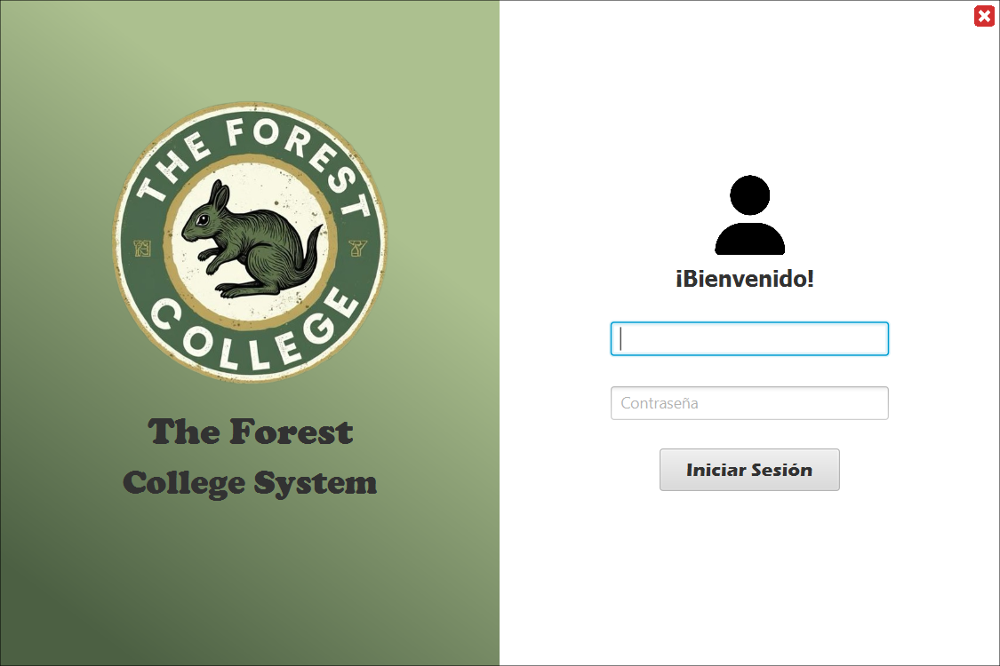<br><sub>Inicio de sesi&oacute;n</sub></td>
      <td align="center"><br><sub>Pantalla de bienvenida</sub></td>
    </tr>
    <tr>
      <td align="center">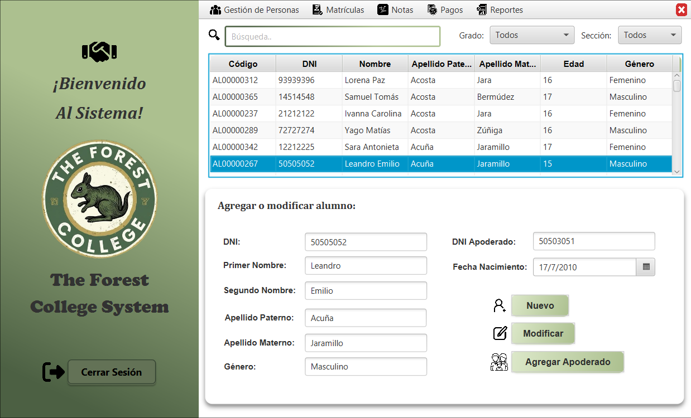<br><sub>Gesti&oacute;n de personas</sub></td>
      <td align="center">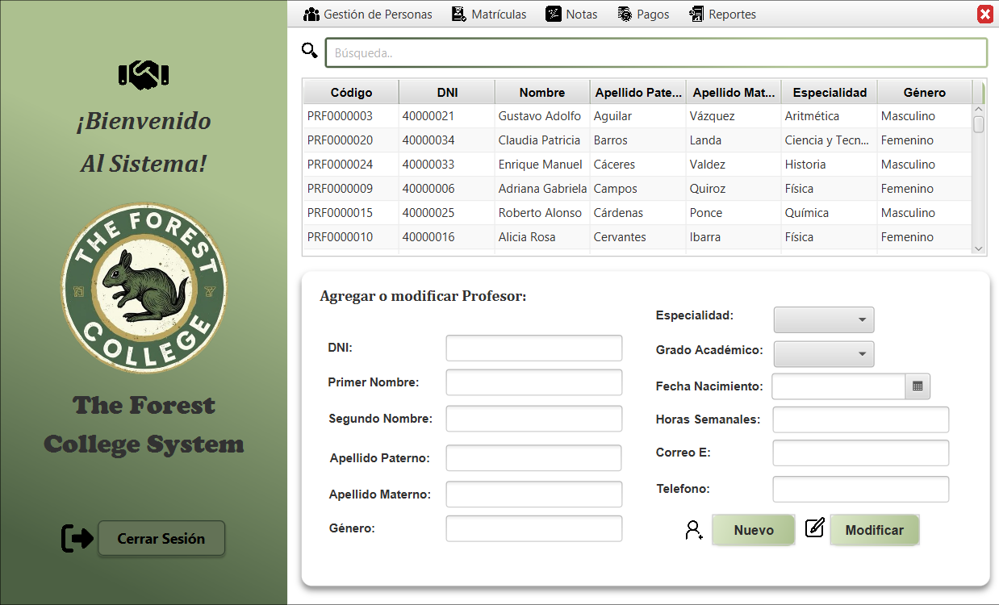<br><sub>Gesti&oacute;n de personas</sub></td>
    </tr>
    <tr>
      <td align="center">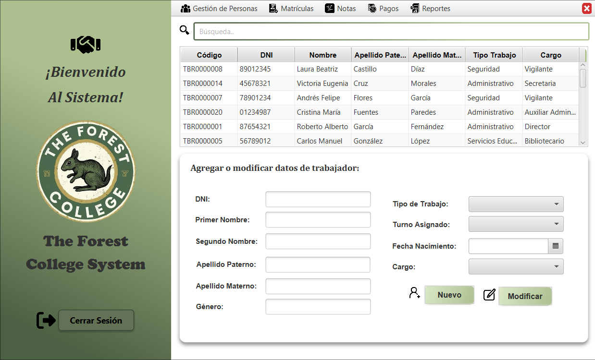<br><sub>Detalle de persona</sub></td>
      <td align="center">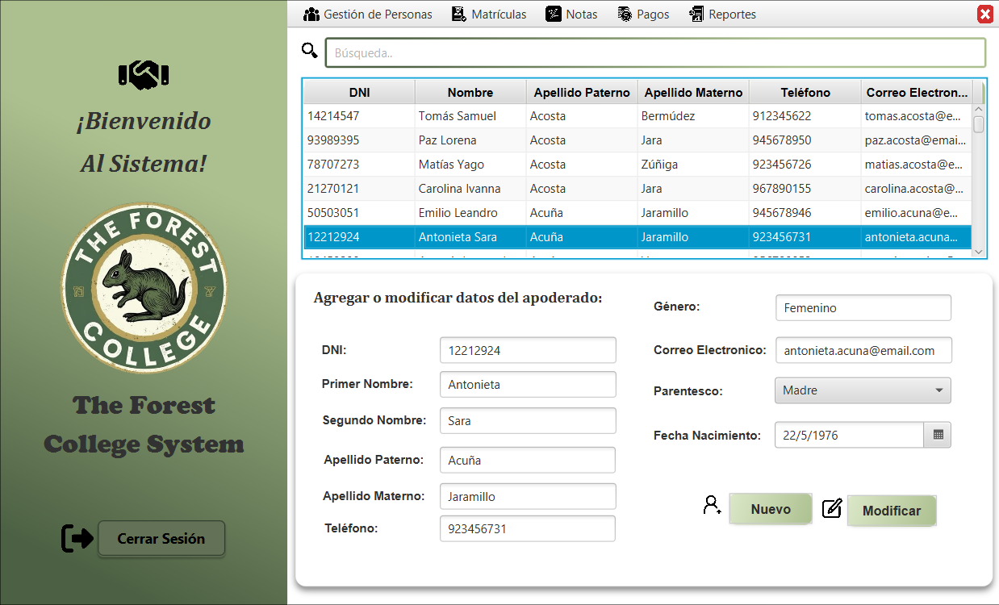<br><sub>Detalle de persona</sub></td>
    </tr>
    <tr>
      <td align="center">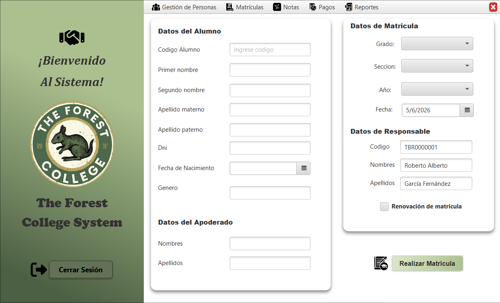<br><sub>Matr&iacute;cula</sub></td>
      <td align="center">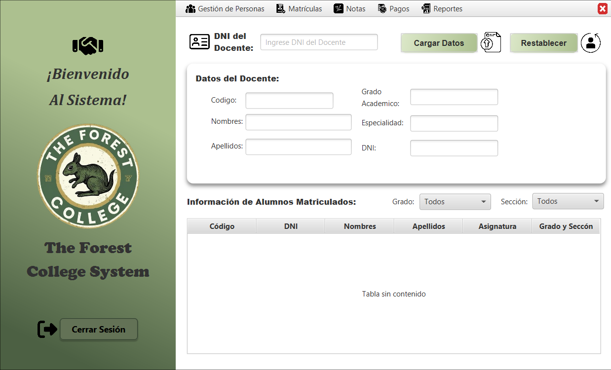<br><sub>Matr&iacute;cula</sub></td>
    </tr>
    <tr>
      <td align="center">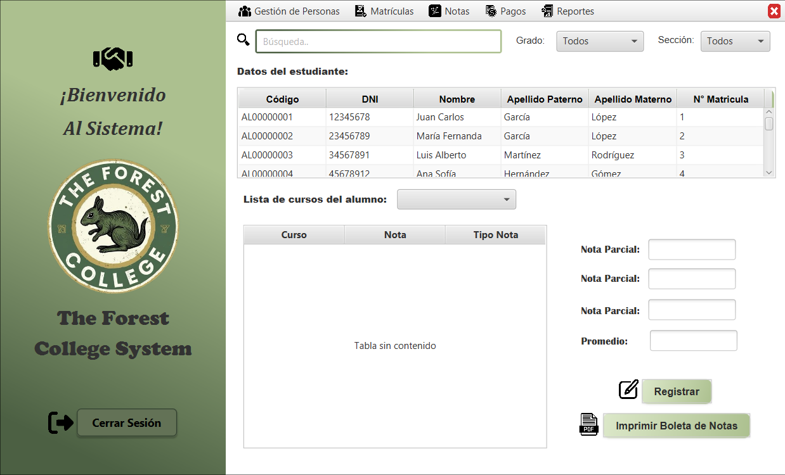<br><sub>Gesti&oacute;n de notas</sub></td>
      <td align="center">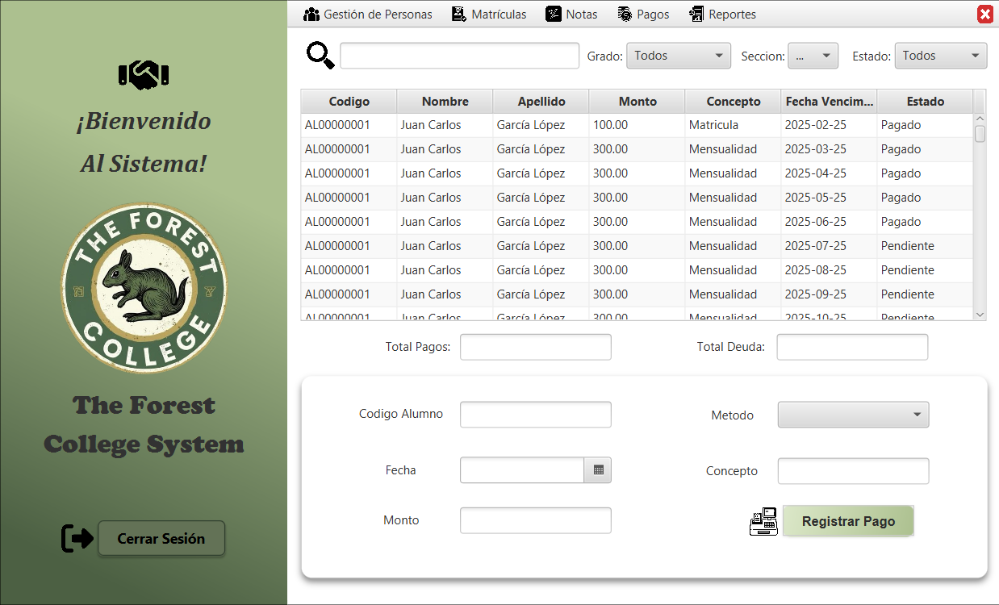<br><sub>Gesti&oacute;n de pagos</sub></td>
    </tr>
    <tr>
      <td align="center">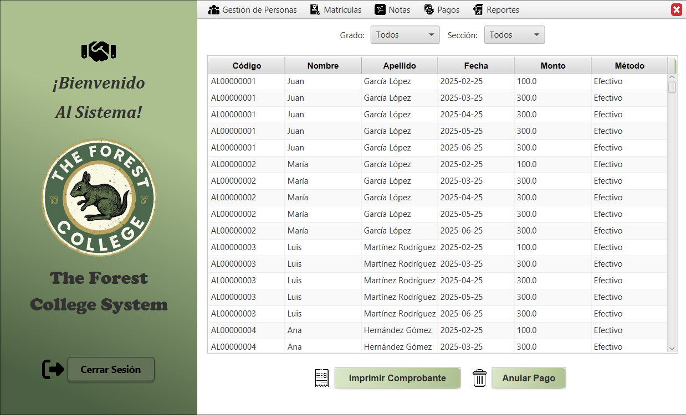<br><sub>Detalle de pagos</sub></td>
      <td align="center">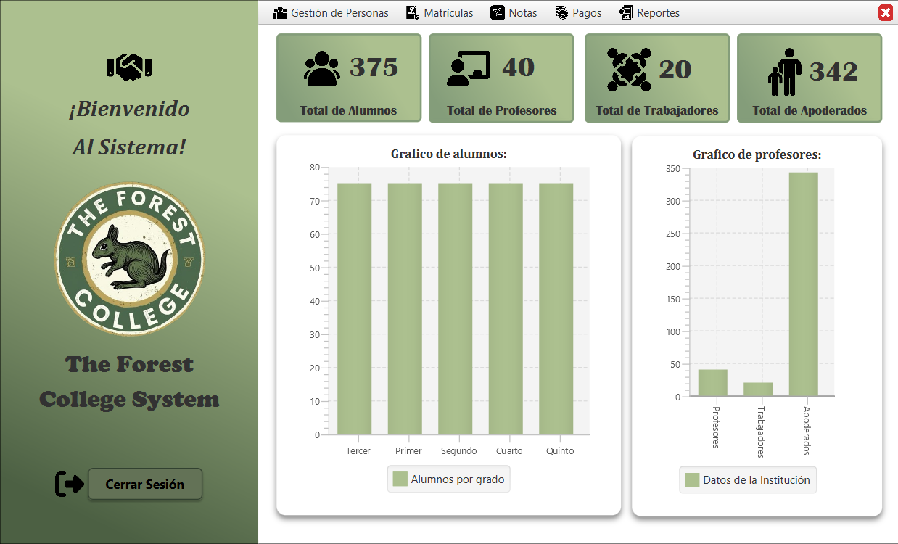<br><sub>Reportes</sub></td>
    </tr>
    <tr>
      <td align="center">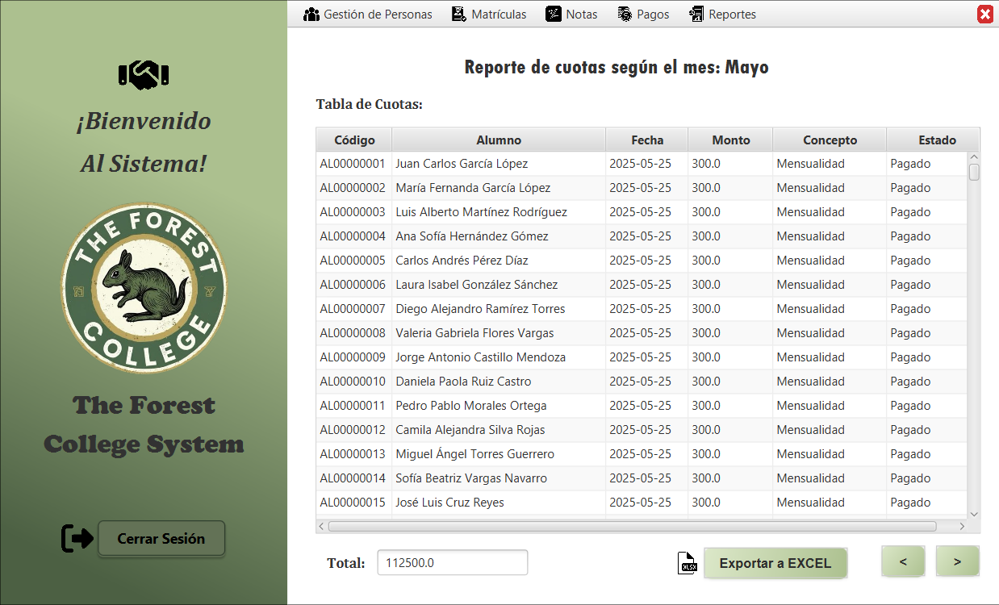<br><sub>Reportes</sub></td>
      <td></td>
    </tr>
  </table>
</div>

---

## Tecnolog&iacute;as utilizadas

| Tecnolog&iacute;a       | Prop&oacute;sito                          |
|------------------------|-------------------------------------------|
| **Java 24**            | Lenguaje principal con preview features   |
| **JavaFX 17**          | Interfaz gr&aacute;fica de escritorio     |
| **Java FXML**          | Dise&ntilde;o de interfaces en XML         |
| **CSS**                | Estilizado de la interfaz                 |
| **MySQL**              | Base de datos relacional                  |
| **iTextPDF 5.5.13**    | Generaci&oacute;n de comprobantes y libretas PDF |
| **JExcelAPI 2.6.12**   | Exportaci&oacute;n de reportes a Excel    |
| **ControlsFX 11.2.1**  | Componentes JavaFX mejorados              |
| **Ikonli 12.3.1**      | Iconos para la interfaz                   |
| **BootstrapFX 0.4.0**  | Estilos tipo Bootstrap                    |
| **TilesFX 21.0.3**     | Paneles de dashboard                      |
| **Maven**              | Herramienta de construcci&oacute;n        |

## Funcionalidades principales

- **Autenticaci&oacute;n por roles** &mdash; Administrador, Profesor y Secretario con permisos diferenciados
- **Gesti&oacute;n de personas** &mdash; CRUD completo de alumnos, profesores, apoderados y trabajadores
- **Matr&iacute;culas** &mdash; Registro y renovaci&oacute;n de matr&iacute;culas por grado y secci&oacute;n
- **Notas** &mdash; Registro de 3 notas parciales por curso con c&aacute;lculo autom&aacute;tico de promedios
- **Pagos y cuotas** &mdash; Administraci&oacute;n de cuotas mensuales y registro de pagos con m&uacute;ltiples m&eacute;todos
- **Comprobantes PDF** &mdash; Generaci&oacute;n autom&aacute;tica de comprobantes de pago
- **Libreta de notas PDF** &mdash; Generaci&oacute;n de libretas de notas por alumno
- **Reportes Excel** &mdash; Exportaci&oacute;n de reportes de pensiones a formato XLS
- **Dashboard** &mdash; Reportes generales del colegio con indicadores

## Requisitos

- **Java 24** o superior
- **Maven** &uacute;ltima versi&oacute;n estable
- **MySQL 8+** con base de datos `bdcolegio`
- Conexi&oacute;n a internet (para carga de iconos remotos en PDFs)

## Instalaci&oacute;n y ejecuci&oacute;n

```bash
# Clonar el repositorio
git clone https://github.com/tu-usuario/colegio-system.git

# Ir al directorio del proyecto
cd colegio-system

# Ejecutar la aplicaci&oacute;n
./mvnw clean javafx:run
```

## Estructura del proyecto

```
src/
  main/
    java/
      Clases/
        AppColegio.java              -- Punto de entrada de la aplicaci&oacute;n
        ConexionBD/                  -- Conexi&oacute;n a MySQL y DAOs
        ClasesFinanzas/              -- L&oacute;gica de pagos, PDF y Excel
        ClasesGestionEscolar/        -- L&oacute;gica de matr&iacute;cula y notas
        ClasesPersonas/              -- Modelos de personas y usuarios
      Forms/                         -- Controladores de cada formulario
    resources/
      Formularios/                   -- Vistas FXML y archivos CSS
      icons/                         -- Iconos de la aplicaci&oacute;n
capturas/                            -- Capturas de pantalla del sistema
comprobantesDePago/                  -- PDFs de comprobantes generados
libretasNotas/                       -- PDFs de libretas de notas generadas
reporteExcel/                        -- Reportes Excel generados
```

## Licencia

Este proyecto es de c&oacute;digo abierto. Consulta el archivo `LICENSE` para m&aacute;s informaci&oacute;n.
